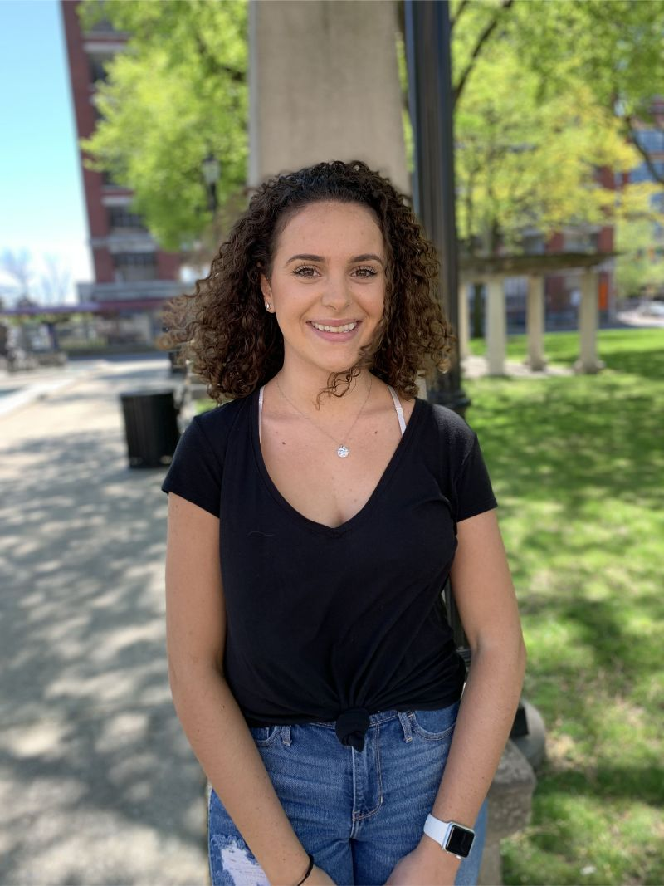

# Staff
## Editorial Team
 **Eliana Puschett**- *Editor-in-Chief*
Sophomore
English and Digital Studies Major, Communication Minor
“Some see a pen, I see a harpoon.” -twenty one pilots: “Ode to Sleep”

 **Maggie Barrett**- *Managing Editor*
Sophomore
Health Science Major, Pre-Nursing Major
Quote: “Learn from yesterday, live for today, hope for tomorrow.” -Albert Einstein

 **Kristal Rivera**
Junior
English Major, Writing Minor
“The saddest thing in life is wasted talent.” -A Bronx Tale

 **Albert Mancao**
Junior
English Major, Digital Studies Minor
“From where you're kneeling it must seem like an 18-carat run of bad luck. Truth is...the game was rigged from the start.” -Benny, *Fallout: New Vegas*

 **Jaslynn Martinez**
Sophomore
English major, Philosophy minor
“People say nothing is impossible, but I do nothing every day.” - A.A. Milne

## Art Team
 **Traijhon Greer** *Art Director*
 **John Paul Bourg**
 **Jianna Acerbo**
Junior
English Major, Digital Studies and Creative Writing Minor
“There will be people that will say you can’t make a living out of something you love to do. But are you really living by not doing it?” - Olan Rogers

 **Sylvia Green**
Junior
Urban Studies Major, Legal Studies Minor
“We delight in the beauty of the butterfly, but rarely admit the changes it has gone through to achieve that beauty” -Maya Angelou

## Copyediting Team
 **Stephen Fox**- *Copy Chief*
Senior
English Major, Art Minor
“You can never know everything, and part of what you know is always wrong. A portion of wisdom lies in knowing that. A portion of courage lies in going on anyway.”- Robert Jordan

 **Yeilyne Rodriguez**
Senior
Marketing Major, Minor in Writing
“Would you like me to give you a formula for success? It’s quite simple, really: Double your rate of failure. You are thinking of failure as the enemy of success. But it isn’t at all. You can be discouraged by failure or you can learn from it, so go ahead and make mistakes. Make all you can. Because remember that’s where you will find success.”-Thomas J. Watson

 **Molly Rollins**
Junior
English Major, Journalism/Communications Minor
“Either write something worth reading or do something worth writing.” -Ben Franklin

 **Chanel Richardson**
Sophomore
English Major
“You’ll never be enough for anyone, until you’re enough for yourself”- Anonymous

# Authors
 **Victoria Wroblewski** ‘20
English Major, Writing and Film minors
This piece started because I didn't like the way Supernatural season 1 episode 6 (also named Skin) resolved. I thought that the victim in the first scene ought to be the monster. When the show didn't cooperate, I decided to make my own story. When I started writing, it quickly became a means of manipulating expectations and perceptions. Eventually, it transformed into a vehicle for exploring the monstrous in humans alongside fictional monsters.

 **Stephen Fox** ‘19
English Major, Art Minor
As a huge fan of the fantasy and sci-fi genres, I regularly run into monsters in media. The inspiration for this piece came from me emphasizing with these monsters, wondering what their stories were, and what their presence might represent. Since they've been around almost since civilization began, I wanted to study why monsters had such a profound effect on people, including myself.  This resulted in a deep dive into the nature of monstrosity itself, which I've always felt was a rather under-examined topic.

 **Samuel Lyons** ‘19
I’m a senior at Rutgers-Camden studying English literature and poetry. I hope to go for my MFA and apply next winter. While I used to write exclusively sonnets, I find it much easier now to write free verse based solely on a title I think of beforehand. I was inspired for ‘Mazurka’ by medieval Polish folklore, as a mazurka is a Polish folk dance. My biggest inspiration for writing these days is my best friend Will, who is an excellent poet.

 **Myron Fields** ‘18
Health Science Major
The best advice I can give to a writer is to observe the world around you as much as possible. Don't be afraid to inquire, don't fear criticism, and most importantly, let your humanity show in everything you write or express.

 **Starla Blatcher** ‘21
Film Major
I'm Starla Blatcher and I'm a film major at Rutgers Camden. I created this film in my Video Production II class. I love science fiction and mystery films. I really wanted to work with the idea of aliens and having these characters that feel inclined to solve this mystery, even though they're not the best suited to do so. The characters are based off of people I know, which was also fun to play around with while writing the script. This film is the first film I've ever directed and written and definitely the most fun I've had while making a film.

 **Emilyann Thompson** ‘22
Health Science Major
This piece was truly a therapeutic journey. What I thought was just a simply a Comp 101 assignment turned into a tool of inspiration and a time of liberation for me and those who read it. I am so blessed to have been able to be apart of this magazine and I hope that someone will be able to read it and relate in someway. I never really considered myself a “writer” because my skill set was not like my professor’s or someone who wrote a book. But through this experience I discovered that being a “writer” is simply having something to say and allowing your audience to feel that. That being said, if I can evoke any emotion or conversation through this piece I will be satisfied. This piece is my story, but I want whoever reads it to reach in, and find whatever they need.

 **Erin Johnson** ’19
English Major, Digital Studies Minor, Painting Minor
My name is Erin Johnson. I’m a senior in my last semester here at Rutgers-Camden graduating with an English major and a minor in Digital Studies and Painting. The most important thing I’ve learned during my college career was to take risks- risks that have helped me create projects like this. It’s so cliche to say (and to hear), but it’s so important for writers and artmakers. You get to experience errors and accidents, and maybe stumble upon something brilliant.

 **Joseph Roman** ‘19
English and Digital Studies Major, Minor in Anthropology
My advice for future writers is to never stop writing, no matter how hard it may be. You can find a creative outlet in even the worst situations. Don't let life's hardships stop you from expressing yourself.

 **Eliana Puschett** ‘21
English and Digital Studies Major, Communication Minor
I based my piece off of a woman who meant the world to me, my mother. I wanted to show how the world can create tragedy out of the suffering of others and to enable others to receive a new perspective of addicts. I wish I had insightful words to offer aspiring writers, but I don't. The truth is, all you can do is to continue to write and to never stop, even if the world is trying to turn you down a negative path. Put your suffering into your words, and I can promise you that something beautiful will come of it.  
