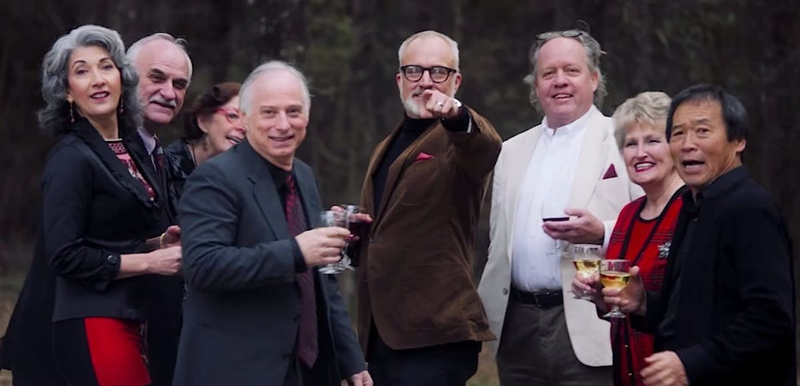
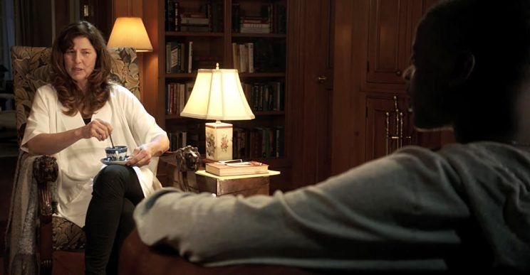

When I was attending high school (which was a long time ago), a group of friends and I were having a discussion about race.  "Sometimes, I think it would be cool to be Black" commented one of my friends.  Since I was the only Black male in the group, I snorted loudly at his observation.  I took the tone of a Southern woman who gives you the classic "bless his heart" passive/aggressive declaration.  "Trust me, it's not as great as you think", I opined. "But, he continued, you guys are great athletes, performers, and singers.” I wryly agreed that all those things were true, but at the end of the day, he was simply in love with black culture, not the black experience of day to day living.

 *Get Out* (directed by Jordan Peele) is a horror/drama film which tells the story of Chris Washington (Daniel Kaluuya) and Rose Armitage (Allison Williams), an interracial couple who decide that it's time to seek the blessing of  Rose's parents (reminiscent of *Guess Who's Coming To Dinner?*). What follows next is an embarrassing dialogue between Chris and Rose's parents, Dean and Missy. Dean and Missy assure Chris that they are fine with their daughter dating a Black man, but Chris becomes suspicious of their strained behavior.  He happens to notice that the black servants in the Armitage home are puppet-like, as if almost controlled. The turning point of the film occurs when Chris is sitting down with Missy, who is a trained psychologist.  Missy is upset that Chris is a smoker, and feels that his smoking habit endangers the health of her daughter.  As she drinks her tea from a china cup, stirring with a silver spoon, she berates Chris and says, "That's my kid. That is my kid, you understand (Get Out - Hypnosis Scene)?"

Missy then induces a hypnotic state in Chris while stirring her teacup and plants a subliminal suggestion in his mind. It is then that Chris enters the Sunken Place, a place that Jordan Peele describes thusly: "The Sunken Place means we are marginalized.  No matter how hard we scream, the system silences us," (Lincoln). Chris eventually realizes the awful truth, that Rose has effectively trapped him at the Armitage residence.  The purpose of Chris' imprisonment soon becomes apparent; his body is to be auctioned off to a cabal of wealthy bidders.  The Armitages belong to the Order of Coagula, an evil society  that specializes in capturing Black people with the purpose of transferring the consciousnesses of predominantly rich White buyers into healthy African Americans.

 Rose seduced Black men, while her brother Jeremy abducts them. This is the very essence of "living vicariously" through someone, the very concept that I mentioned in my opening paragraph.  These wealthy individuals had lived their lives with privilege, but that was not enough to satiate them.  Instead, the very humanity was stripped from these unfortunate Black folks who simply were guilty of having "desirable traits."  

Needless to say, the release of *Get Out* caused quite a stir in America.  The film was highly praised, but also was critiqued as unrealistic and far-fetched.   However, I would argue that Jordan Peele is quite correct in his description of the Sunken Place.  The history of race relations in the United States has been one of intolerance and unmitigated strife.  Before I begin the main premise of this essay, I would like to state to the reader that the term "race" is simply a construct.  There is only one race, and 99.99% of all humans have the same ancestral mother.  The African American sociologist W.E. Du Bois believed that race was erroneously being used to describe social and cultural diversity (Gannon, 2016). Modern science agrees that cultural and ethnic diversities truly define human beings, and features, such as skin tone, are simply phenotypes. The aspect of skin color has been one of the most divisive topics in the United States.  When African slaves were brought to this country, it was determined by the Dutch, Americans, and the British that Blacks were simply inferior because of differing phenotypes.  To the European and American mind, Blacks were simply brutish beasts that made excellent maids, laborers, breeders, and in the case of female slaves, sexual partners.  

##  Slave Auction Flyer from 1823

	There has been a Civil War fought over the issue of slavery, despite the increase of revisionist history pertaining to this subject. South Carolina did fire on Fort Sumter and signed the Declaration of Causes, along with Texas, Mississippi, and Georgia.  After the Emancipation Proclamation, very little changed for freed Blacks in the South, and many migrated up to the Northern states.  Education, family, and especially religion were the glue that held black folk together.  However, American society was not ready to embrace the Negro as an equal.  Blacks still couldn't vote until the Civil Rights Act of 1965, and were viewed as 3/5ths of a person.  The Jim Crow laws that were put in place to systematically oppress Blacks, only fueled the desire for Blacks to strive for freedom from oppression.

In the arena of sports, Blacks were grudgingly considered superior in some aspects.  Jack Johnson stunned the boxing world by winning the Heavyweight Championship in 1908 by beating Tommy Burns from Canada.  Johnson's dominance of that weight class caused resentment among White boxing fans, who began to look for a "great White hope" to deliver the belt back to White hands (ESPN).  Jesse Owens' performance at the 1936 Munich stunned Aryan Germany and the world, but he couldn't find viable work after the Olympics.  As a black athlete, you gained fame and wealth (if you were fortunate), but you never gained respect or parity in the eyes of White America. As Blacks became more educated and excelled in the fields of education, literature, and music, many Whites in America viewed this progress with trepidation.  What if Blacks began to demand the same rights that Whites are afforded?  Would these Blacks want to move into our theaters, attend our schools, and date our sons and daughters?    We see the rise of the Civil Rights Movement with leaders such as King, Malcolm X, and Fred Hampton, each heading up different organizations with the purpose of empowering Blacks.  Despite the race riots of the 60s, despite the institutionalized racism that exists at every level, despite the CIA seeding black neighborhoods with drugs to destroy black families (by incarcerating Black males), African-Americans have continued to survive (Grim, 2017).  

The Sunken Place is a burden that most Black Americans experience in some form every day.  I believe that Lyndon B. Johnson summed it up best: "If you can convince the lowest White man he's better than the best colored man, he won't notice you're picking his pocket. Hell, give him somebody to look down on, and he'll empty his pockets for you (Moyer)".    From a young age, we as Blacks, especially males,  have been taught by our families to watch our actions and words around white people. We as Blacks refer to this as "the talk."  It is not because we lack socialization skills or intelligence, this is done not to offend White people.  The subject of injustice and grievance against minorities goes against the tale (really, myth) of American exceptionalism that is trotted out so conveniently.  White privilege is fragile, and such matters such as reform, introspection, and listening to people of color are low on the list of priorities.  Most minorities are hard working Americans who are just trying to achieve success in life, nothing more.   We don't want your jobs, your homes, anything else that you possess, White America.  We just want to succeed on our own merits, and to be left alone.  We have given America greats in music (jazz, blues, modern gospel, rock), art and literature, medicine, sports, and the first minority President (whose family is superior in every metric compared to the current occupants), and the greatest power couple on the planet in the persons of Beyonce and Jay-Z.  

However, it is exhausting to always be on guard when interacting with members of society, to have a palpable fear of dehumanization, marginalization, and often, subtle microaggressions.  
 *Get Out* was not just a movie about open racism or White supremacy, but how even seemingly liberal-minded, well- intentioned people can have just as much implicit bias as an openly bigoted person.

To illustrate an example of the  sunken place that minorities have to deal with constantly,  some White fans shared their view of the film with Allison Williams, who played the evil antagonist Rose Armitage. Not all viewers could understand how a clean cut, all-American young woman such as Rose could be such an evil character (hmm, probably chaotic evil, but that's for another day).  Allison Williams was being interviewed on Late Night with Seth, and she shared her frustration about how some fans would say the following:

“They’d say ‘she was hypnotized, right?’ And I’m like, no! She’s *just* evil!*
! How hard is that to accept? She’s bad! We gave you *so many ways*
 to know that she’s bad! She has photos of people whose lives she ended behind her! The *minute she can* she hangs them back up on the wall behind her. That’s so crazy! And they’re still like, ‘but maybe she’s also a victim?’ And I’m like, NO! No! And I will say, that is one hundred percent white people who say that to me," (Late Night Seth).

The above passage indicates that despite the very real concepts of institutional racism, discrimination, and murder that has defined America's social fabric that Jordan Peele based this entire film on, many whites simply erased these concerns by viewing the movie through the lens of White privilege. Regardless, Jordan Peele created a film that has gotten not just film viewers, but the country talking about race, power dynamics, and inequality.  However, I will leave the reader with one question.  In this politically charged climate, is *Get Out*
 about the subjugation of Black people, or is it a film commentating on the marginalization of all people who are disenfranchised?

## Works Cited
http://www.espn.com/sportscentury/features/00014275.html

Gannon, M. (2016, February 05). Race Is a Social Construct, Scientists Argue. Retrieved from https://www.scientificamerican.com/article/race-is-a-social-construct-scientists-argue/
Grim, R., Sledge, M., & Ferner, M. (2017, December 07). Key Figures In CIA-Crack Cocaine Scandal Begin To Come Forward. Retrieved from https://www.huffingtonpost.com/2014/10/10/gary-webb-dark-alliance_n_5961748.html

LateNightSeth. “Allison Williams Reveals What White People Ask Her About Get Out.”
, YouTube, 1 Dec. 2017, www.youtube.com/watch?v=2AE0tMvL-aM.

Lincoln, Ross A. “'Get Out' Director Jordan Peele Explains 'The Sunken Place'.”
, 17 Mar. 2017, www.thewrap.com/get-out-director-jordan-peele-explains-the-sunken-place/.

Narcisse, Evan. “How Get Out Inspired a New College Course on Racism and Horror.”
, io9.Gizmodo.com, 6 Sept. 2017, io9.gizmodo.com/how-get-out-inspired-a-new-college-course-on-racism-and-1801027341.
SilverLizard85. “Get Out - Hypnosis scene.”
, YouTube, 9 May 2017, www.youtube.com/watch?v=PZX0BNQel_s&feature=youtu.be.
