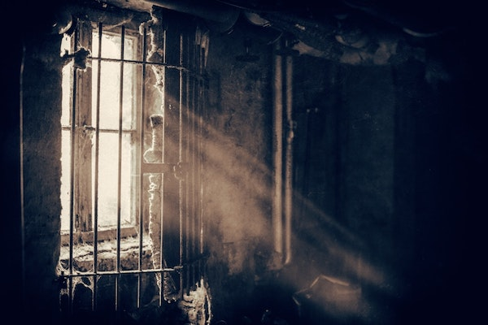

<audio class="audio-player" controls="controls">
  <source src="steve.mp3" type="audio/mp3">
  Your browser does not support audio playback. You can listen by <a href="steve.mp3">downloading the file.</a>
</audio>

*The editors recommend wearing headphones while listening to this piece.*

Soaked in sweat,
His head lays on a hard mattress
His whole body is wet.
He owes his life to the streets and they're coming to collect his debt.
But Steve isn’t dead yet.
For days Steve sits in a cell wondering why the world wants him to fail,
The color of his skin put him on a path destined to rot in jail,
His DNA gave him a melanated pigment of skin,
A true gift until he realizes, it’s harder for him to win.
Black skin is a blessing and a curse,
The potential to be the greatest athlete,
Or dead at sixteen in a hearst
He writes his feelings in a notebook pad,
Thinking of the life he could have had.
Writing film scenes and scripts,
He wanted to direct movies and cut clips,
Now he’s in state detention taking pictures and fingerprints.
He doesn’t want to go to prison,
Where power dynamics make young boys strip.
He clutches his journal with a tight grip
His whole body shakes down to the quiver of his lip
With each page flip,
His story intensifies,
The pool of sweat beneath him grows larger with each drip.
He has to persevere
He must ride out the ship.
From this day on,
 His shoulder will always have a chip.
Imaginary fears turn into real waterfalls of tears,
A guilty conviction means he’ll never find his true career.
He tries hard to catch his breath,
The state says he is an accomplice to Nesbitts death.
On a cool day,
 Law abiding citizens turned into uptown menaces.
Osvaldo is a Diablo
No room for introduction
He’s immediately become Steve’s archnemesis.
The police hunted him down,
The looks in their eyes were venomous.
King and Bobo were there, but they don’t care,
A plea deal has already shortened their sentences.
He’s from the city of New York,
No silver spoons,
Now he eats jail food with a plastic fork.
Black Boy’s turn into Native Sons,
Harlem Bballers turn into niggas with guns.
He’s been a black man since he was ten,
And accelerated childhood robs one of their empathy again.
Richard Wright used a pen
But Steve and King wrote their story with a Mac-10.
It was an armed robbery of the corner store,
Deprived black men in Harlem will do anything to get some more.
Steve was on the lookout,
Gave them the signal when he walked through the door.
Two of them pushed up to the counter
And demanded everything in the drawer.
They gave Nesbitt five seconds to move,
But his life was over in four.
Sixty years later the squeeze of a trigger
Has them in the same place as Bigger.
Forced to be the bigger man in a society that haunts them,
Monsters become real making bodies fall like autumn.
What’s the difference between prosecution and persecution?
Which education is more valuable?
One from the streets or one that comes with a tuition?
He should be in school taking his finals
But instead his last test is a 1st degree murder trial.
Petrocelli argued for the state,
Another cog in the wheel that doesn’t want us to be great.
Neutral faces and expressions hide ideologies of hate.
Petrocelli reels him in with the bait.
Sessions, motions, witnesses and breaks,
Now Steve must wait for a jury opposite of his peers to decide his fate.
Hes described as compassionate, talented, and bright,
But none of that matters in the juries eyesight.
If he’s convicted he may never see the light,
Of being who he’s meant to be.
Lawyers tell him to take a plea,
But he wants to let the truth set him free.
They come out with a decision.
He gasps.
Finally.
He can go home.
He’s not guilty.
